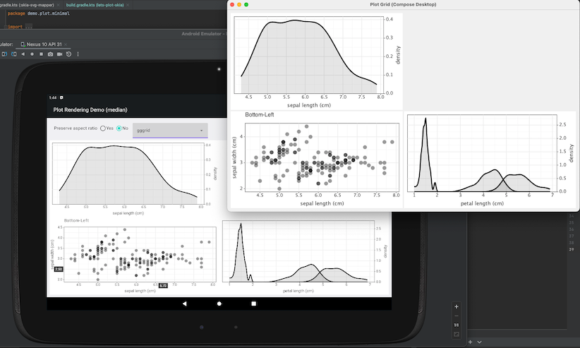

# Lets-Plot Compose Frontend

[](https://kotlinlang.org/docs/components-stability.html)
[](https://confluence.jetbrains.com/display/ALL/JetBrains+on+GitHub)
[](https://raw.githubusercontent.com/JetBrains/lets-plot-compose/master/LICENSE)
[](https://github.com/JetBrains/lets-plot-compose/releases/latest)

**Lets-Plot Compose Frontend** is a Kotlin Multiplatform library that allows you to embed \
[Lets-Plot](https://github.com/JetBrains/lets-plot) charts in a [Compose Multiplatform](https://github.com/JetBrains/compose-multiplatform) \
application targeting Desktop, Android, and WasmJS.

### Supported Targets

- **Desktop** (macOS, Windows, Linux)
- **Android**
- **WasmJS**

For more details see [Compose multiplatform compatibility and versioning overview](https://www.jetbrains.com/help/kotlin-multiplatform-dev/compose-compatibility-and-versioning.html).




## Dependencies

- Compose Multiplatform: [1.11.0](https://github.com/JetBrains/compose-multiplatform/releases/tag/v1.11.0)
- Lets-Plot Kotlin API: [4.14.0](https://github.com/JetBrains/lets-plot-kotlin/releases/tag/v4.14.0)
- Lets-Plot Multiplatform: [4.10.1](https://github.com/JetBrains/lets-plot/releases/tag/v4.10.0)
                               
- kotlinx-datetime: [0.6.2](https://github.com/Kotlin/kotlinx-datetime/releases/tag/v0.6.2)
- kotlinx-coroutines: [1.8.0](https://github.com/Kotlin/kotlinx.coroutines/releases/tag/1.8.0)


### Compose Multiplatform for Desktop

```kotlin
dependencies {
    implementation(compose.desktop.currentOs)
    implementation(compose.components.resources)

    // Lets-Plot Kotlin API
    implementation("org.jetbrains.lets-plot:lets-plot-kotlin:4.14.0")

    // Optional: contains the PlotImageExport utility which enables exporting to raster formats.
    implementation("org.jetbrains.lets-plot:platf-awt:4.10.1")

    // Lets-Plot Compose UI
    implementation("org.jetbrains.lets-plot:lets-plot-compose:3.2.0")
}
```

See examples: 
- [Compose desktop](https://github.com/JetBrains/lets-plot-compose-demos/blob/main/compose-desktop/build.gradle.kts)
- [Compose multiplatform](https://github.com/JetBrains/lets-plot-compose-demos/blob/main/compose-multiplatform/build.gradle.kts)

> [!TIP]
> The `org.jetbrains.lets-plot:lets-plot-kotlin` dependency transitively brings in 3rd-party runtime dependencies:
> - `org.jetbrains.kotlinx:kotlinx-datetime:0.6.2`
> - `org.jetbrains.kotlinx:kotlinx-coroutines-core:1.8.0`
>
> For a dependency-free configuration (JVM/Desktop target only), replace `lets-plot-kotlin` with the following:
> ```kotlin
> implementation("org.jetbrains.lets-plot:lets-plot-kotlin-kernel:4.14.0")
> implementation("org.jetbrains.lets-plot:lets-plot-common:4.10.1")
> ```


### Compose Multiplatform for Android

```kotlin
dependencies {
    // Lets-Plot Kotlin API
    implementation("org.jetbrains.lets-plot:lets-plot-kotlin-kernel:4.14.0")

    // Lets-Plot Compose UI
    implementation("org.jetbrains.lets-plot:lets-plot-compose:3.2.0")
}
```

See examples:
- [Android minimal](https://github.com/JetBrains/lets-plot-compose-demos/blob/main/compose-android-min/build.gradle.kts)
- [Compose multiplatform](https://github.com/JetBrains/lets-plot-compose-demos/blob/main/compose-multiplatform/build.gradle.kts)
     

### Compose Multiplatform for WasmJS

```kotlin
dependencies {
    // Lets-Plot Kotlin API
    implementation("org.jetbrains.lets-plot:lets-plot-kotlin:4.14.0")

    // Lets-Plot Compose UI
    implementation("org.jetbrains.lets-plot:lets-plot-compose:3.2.0")
}
```

See examples:
- [Compose multiplatform](https://github.com/JetBrains/lets-plot-compose-demos/blob/main/compose-multiplatform/build.gradle.kts)


## More Examples

You will find complete examples of using **Lets-Plot Kotlin API** with **Lets-Plot Compose Frontend** in the following\
GitHub repository: [JetBrains/lets-plot-compose-demos](https://github.com/JetBrains/lets-plot-compose-demos).

## Change Log

See [CHANGELOG.md](https://github.com/JetBrains/lets-plot-compose/blob/main/CHANGELOG.md).

## Code of Conduct

This project and the corresponding community are governed by the
[JetBrains Open Source and Community Code of Conduct](https://confluence.jetbrains.com/display/ALL/JetBrains+Open+Source+and+Community+Code+of+Conduct).
Please make sure you read it.

## License

Code and documentation released under
the [MIT license](https://github.com/JetBrains/lets-plot-compose/blob/master/LICENSE).
Copyright © 2023, JetBrains s.r.o.
